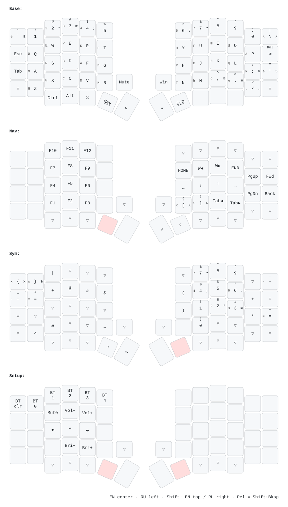

# PandaKB Sofle

Диаграмма раскладки генерируется автоматически из [`config/Sofle.keymap`](config/Sofle.keymap) при push через [keymap-drawer](https://github.com/caksoylar/keymap-drawer) (workflow [Draw ZMK keymaps](.github/workflows/draw-keymaps.yml)).

Описание решений по раскладке: [`config/KEYMAP.md`](config/KEYMAP.md).

После push GitHub Actions обновит `keymap-drawer/Sofle.svg`.
